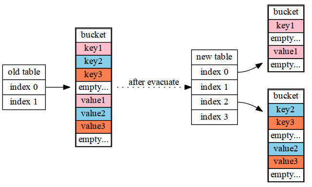
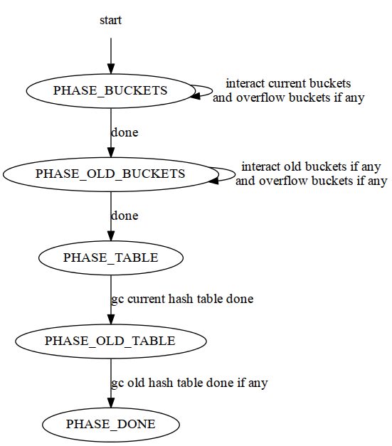

Read Go - Map | 2013-04-18
# Read Go - Map

这篇文章主要介绍Go中Map的相关内容，主要包括以下几部分：

- map的内部实现。
- map迭代器的实现。
- gc是如何处理map object的。

## Implementation of Map

在go中，map是用hash table来实现的，其中每个bucket中存放最多8个key/value pair,
如果多于8个，那么会申请一个新的bucket，并将其与之前的bucket链起来。
所以一个map的整体结构如下图所示：

看完了上述的图，让我们想一下如何通过一个key找到其对应的value：

1. 通过某种hash算法得到key对应的hash值。
2. 将hash的低位当作bucket数组的index，找到key所在的bucket。
3. 将hash的高位当作key在bucket中offset，比较其中的key与所给的key是否相等。
4. 如果相等，则返回其对应的value，反之，在overflow buckets中按照上述方法继续寻找。

**NOTE**:这里key和value的存储方式会根据实际元素的类型而变化，具体是这样的：

~~~ {prettyprint}
if sizeof(key or value)<=128 {
	inline it;
} else {
	save its address;
}
~~~
还有一点，这里存储结构是将keys放在一起，values放在一起，可能有的同学会想:
为什么不将key和对应的value放在一起，那么存储结构将变成key1/value1/key2/value2...
设想如果是这样的一个map[int64]int8,并且考虑字节对齐，那么会有多少padding呢？

不得不说通过上述的一个小细节，可以看出go在设计上的深思熟虑。
设计的上的考量还不止上述一处，因为底层的数据结构是hash table，那么就不得不考虑到 grow table的需求。
go中的grow是将原有的table size double一下，那么何时grow最合适呢？
如果grow的太频繁，会造成空间的利用率很低，
如果很久才grow，会形成很多的overflow buckets，查找的效率也会下降。
这个平衡点如何选取呢(在go中，这个平衡点是有一个宏控制的(`#define LOAD 6.5`),
它的意思是这样的，如果table中元素的个数 `>` table中能容纳的元素的个数×LOAD,
那么就触发一次grow动作。

那么这个6.5是怎么得到的呢？原来这个值来源于作者的一个测试程序，遗憾的是没能找到相关的源码，不过作者给出了测试的结果：

LOAD | %overflow | bytes/entry | hitprobe | missproble
:---: | :---: | :---: | :---: | :---:
4.00 | 2.13  | 20.77 | 3.00 | 4.00
4.50 | 4.05  | 17.30 | 3.25 | 4.50
5.00 | 6.85  | 14.77 | 3.50 | 5.00
5.50 | 10.55 | 12.94 | 3.75 | 5.50
6.00 | 15.27 | 11.67 | 4.00 | 6.00
6.50 | 20.90 | 10.79 | 4.25 | 6.50
7.00 | 27.14 | 10.15 | 4.50 | 7.00
7.50 | 34.03 | 9.73  | 4.75 | 7.50
8.00 | 41.10 | 9.40  | 5.00 | 8.00

- %overflow: 有overflow bucket的百分比
- bytes/entry: 每个key/value pair所浪费的空间。
- hitprobe: 当查找一个存在的key对应的value时，需要遍历的pair的数目。
- missproble: 当查找一个不存在的key对应的value时，需要遍历的pair的数目。

可以看出作者取了一个相对适中的值。

当hash table grow之后，需要将那些旧的pair重新散列到新的table上(src中称之为evacuate)，
这个工作并没有在grow之后，一次性完成，而是逐步的完成（在insert和remove时每次搬移1-2个pair）。
需要注意的是:那些已经evacuated的buckets会被mark标记：

~~~ {prettyprint}
#define evacuated(b) (((uintptr)(b)->overflow & 1) != 0)
~~~

在evacuate的过程中，一个old bucket中的pairs会被重新散列到2个不同的new bucket中:

~~~ {prettyprint}
if (hashValue & oldTableCapacity == 0) {
	newBuckets[i] = oldBuckets[i];
} else {
	newBuckets[i + oldTableCapacity] = oldBuckets[i];
}
~~~

正是由于这个工作是逐渐完成的，这样就会导致一部分数据在old table中，一部分在new table中，
所以对于hash table的insert, remove, lookup操作的处理逻辑产生影响。

### lookup:

1. 根据key算出hash值。
2. 如果存在old table, 首先在old table中查找，如果找到的bucket已经evacuated，转到步骤3。
反之，返回其对应的value。
3. 在new table中查找对应的value。

### insert:

1. 根据key算出hash值，进而得出对应的bucket。
2. 如果bucket在old table中，将其重新散列到new table中。
3. 在bucket中，查找空闲的位置，如果已经存在需要插入的key，更新其对应的value。
4. 根据table中元素的个数，判断是否grow table。
5. 如果对应的bucket已经full，重新申请新的bucket作为overbucket。
6. 将key/value pair插入到bucket中。

### remove:

1. 根据key算出hash值，进而得出对应的bucket。
2. 如果bucket在old table中，将其重新散列到new table中。
3. 在对应的bucket以及它的overbuckets中，查找对应的pair并将其删除
（这里的删除，只是将位置信息清0:

~~~ {prettyprint}
b->tophash[i] = 0;
h->count--;
~~~

而具体的内存释放，会根据flag去处理:

~~~ {prettyprint}
if((h->flags & CanFreeKey) != 0) {
	runtime·free(k);
}
if((h->flags & IndirectValue) != 0) {
	runtime·free(v);
}
~~~

这里有2个TODO:

1. 将多个几乎要empty的bucket合并。
2. 如果table中元素很少，考虑shrink table。(毕竟现在的实现只是单纯的grow)

## Map Interation

Map Interation的实现比较简单，有个原则就是如果同时存在old和new table，
优先遍历old table中那些没有evacuated的buckets。

**NOTE:**因为old bucket中的pair会被重新散列到new table中的2个bucket中，
所以在遍历的过程中，需要对判断pair是否属于当前的bucket。

## GC Interation

gc的Interation核心是一个状态机：

每次interact之后返回key/value pair，当然，如果有overflow buckets，也会将其返回。
具体的数据结构如下：

~~~ {prettyprint}
struct hash_gciter_data
{
	uint8 *st;			/* internal structure, or nil */
	uint8 *key_data;		/* key data, or nil */
	uint8 *val_data;		/* value data, or nil */
	bool indirectkey;		/* storing pointers to keys */
	bool indirectval;		/* storing pointers to values */
};
~~~
- st: 存放那些malloc的objects，例如overflow buckets。

之后gc根据key和value的type，判断value，key是否是一个二级指针，从而进行深入的gc。

FIN.
