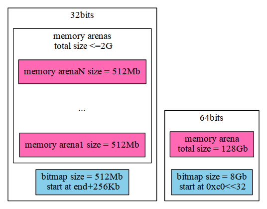
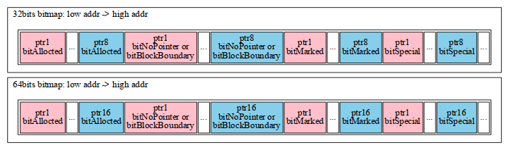
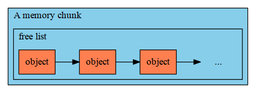
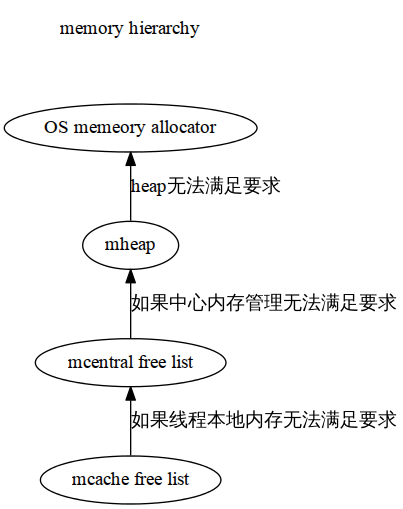
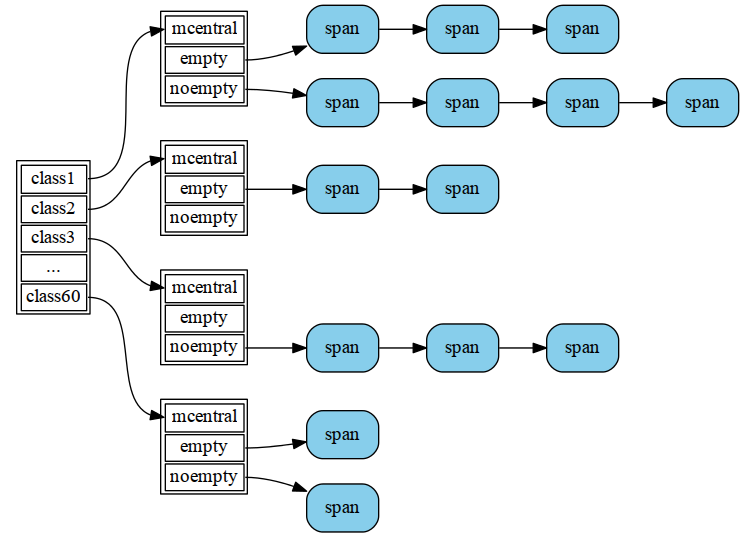
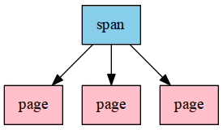
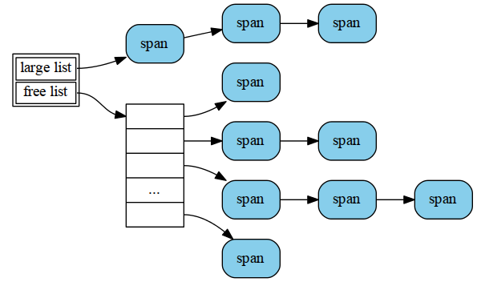

Read Go - Memory | 2013-03-27
这篇主要介绍go源码的内存管理的部分。
go的内存管理主要是借鉴了[tcmalloc](http://goog-perftools.sourceforge.net/doc/tcmalloc.html)。

## Init

### Create rules

由于go的内存管理是以page为单位的，所以当分配比较小的内存时，
需要按page向上对齐进行分配。
为了在分配小内存时，能够直接得到与申请大小相匹配的page的个数，
go在最开始的地方，首先初始化了3张表：

~~~ 
int32 runtime·class_to_size[NumSizeClasses];
int32 runtime·class_to_allocnpages[NumSizeClasses];
int32 runtime·class_to_transfercount[NumSizeClasses];
~~~
如果申请的大小n: `0 <= n <= MaxSmallSize` (其中`MaxSmallSize`为32K),
那么根据n就可以得出其所属的class, 最终根据该class得出需要申请的内存的大小。
其中：

- `class_to_size[i]`: 为第i个class中最大的申请大小。
- `class_to_allocnpages[i]`: 为第i个class中申请的page的个数。
- `class_to_transfercount[i]`: 为从`central lists`转移到线程本地`free
  list`的object的数目。

最终形成下表：

class | maxSize | allocNPages | transfercount
:--- | :---: | :---: | :---:
0 | 0 | 0 | 0
1 | 8 | 1 | 32
2 | 16 | 1 | 32
... | align=16 | 1 | 32
9 | 128 | 1 | 32
... | align=size/8 | ... | ...
35 | 2048 | 1 | 32
...| align=256 | ... | ...
60 | 32768 | 8 | 2

- size的取值除了按照上述的align递增之外，如果当前class计算出的需要分配page的个数
以及一起可包含的object的个数和前一个class相同，这样就会将前一个class的size修改成当前的size。
- allocnpages的取值需满足碎片的大小小于等于总大小的1/8。
即：`allocsize%size <=allocsize/8`
- transfercount：`transfercount = 64*1024/size && 2 <= transfercount <= 32`

那么申请的大小和class的对应关系又是如何的呢？
首先所有的申请的大小是8字节向上对齐,然后根据对齐后的大小，在上述的61个class中找出最小的满足其要求的class。
即`allocSize <= class_to_size[i]`

### Alloc all we want

go首先在堆上申请足够大小的连续的虚拟地址空间(arena)，同时建立一个bitmap使得每个虚拟地址都有与之对应的4bit的元信息。
针对32/64位系统会申请不同大小的arena和bitmap：

64-bit系统：`arena_size=128Gb, bitmap_size=128/(8*8/4)=8Gb`,
其中arena的开始地址为`0x00c0<<32`

32-bit系统：`arena_size=2Gb, bitmap_size=2/(4*8/4)=512Mb`,
其中arena的起始地址为当前数据段的地址向上256Kb，再以1Mb向上对齐。
至于为什么要向上偏移256Kb，是因为操作系统需要在数据段之后保留一段空间。

另外还有一点需要注意下:在32位系统，最开始并没有一次性申请2Gb的虚拟内存，而是先申请512Mb的内存，当这512Mb内存快要用完了，再向操作系统申请新的内存。
但是这样就会出现一种可能，下一次申请的内存地址并不在最开始定义的2G的地址空间内，这个问题等我们后续会结合具体的情景去分析。

其中bitmap的结构有必要说一下，对于每个指针（`void *`），都有4个bit的描述信息，
这4个bits在bitmap中并不是连续的，而是彼此之间间隔`wordsPerBitmapWord=bitShift=sizeof(void*)*8/4`,
所以，对于32位系统，一个uintptr（32bit）可以容纳8个指针，
而对于64位系统，一个uintptr（64bit）可以容纳16个指针。

由于bitmap是从`arena_start`想低地址不断增长的。
所以如果给定一个指针p，我们就可以通过下面的转换关系得到其对应的bits：

~~~ 
off = p - (uintptr*)mheap.arena_start;
b = (uintptr*)mheap.arena_start - off/wordsPerBitmapWord - 1;
shift = off % wordsPerBitmapWord
bits = *b >> shift;
~~~

## Allocators

在go中主要有3种memory allocator：

1. 用于分配特定数据结构的`FixAlloc`。
2. 用于分配小数据的`mcache`。
3. 用于分配大数据的`mheap`。

### FixAlloc

FixAlloc的实现主要是一个free-list，每次会向系统申请FixAllocChunk（128Kb）的内存，然后在该chunk上分割成一个个制定大小的object。主要的数据结构如下：

~~~ 
struct FixAlloc
{
	uintptr size;
	void *(*alloc)(uintptr);
	void (*first)(void *arg, byte *p);	// called first time p is returned
	void *arg;
	MLink *list;
	byte *chunk;
	uint32 nchunk;
	uintptr inuse;	// in-use bytes now
	uintptr sys;	// bytes obtained from system
};
~~~
- size: object的大小。
- list: 所有释放的object都挂到该free-list上。
每次分配新的object时，都先从该free-list上去分配，
如果不能满足要求,才向os去申请一个大的memory chunk。
- chunk: 指该chunk上下一个object的指针。
- nchunk: chunk上剩余的可用的内存大小。
- insue: 分配的内存的大小。
- sys: 向os申请的内存的大小。

### mcache

mcache代表每个pthread本地的小内存cache。
对于小内存的申请，步骤如下：

1. 首先根据申请的大小，找到所属的class， 并在mcache对应class的free-list中寻找合适的object，
如果找到，则直接返回，这里的操作无需先获得lock。
2. 如果对应的free-list为空，从中心（mcentral）free-list中，寻找一个free-list，
并将其转移到mcache中，这里需要获得mcentral lock。
3. 如果mcentral对应的free-list为空，则需要从mheap中去申请一些pages，
然后将其切分成对应大小的object，
同样，这里也需要获得mheap lock。
4. 如果mheap中没有足够的内存或者为空，则需要向os去申请一些pages（至少1Mb）。
这里同样需要获得os的lock。

从上述的步骤可以看出，对于内存的分配，其中抽象出4个层级，每一个层级都是为了缩小上一级的锁的粒度，从而降低由于lock操作带来的损耗。

同理，对应的释放步骤如下：

1. 根据释放的大小，找到所属的class，将其添加到相应的mcache的free-list。
2. 如果mcache中缓存的内存太多或者free-list太长，返回一些给mcentral的free-list。
3. 如果在mcentral free-list中的某个span中所有的object都被free，
则将该span返回给mheap。
4. 如果mheap有太多内存，返回一些给os（还没有实现）。

其中`mcache`主要的结构的还是按照class区分大小的list：

`mcentral`类似，只不过其中挂的是一个个的`span`，并不是object。
同时，为了方便管理，`mcentral`会将所有含有空闲内存的的span统一放在一个list中,
而将没有空闲内存的span放在另外一个list中。

### mheap

对于大内存的申请和释放（大于32K）是直接在heap上按page进行的。
其中主要的概念为span和mheap。

首先说一下span，span负责管理地址连续的一系列的pages：

而mheap中则会根据span中包含的page的个数，将不同的span放入到不同的freelist中。
当然，如果page个数太大，则会放入另外一个统一的large-list中。
所以，mheap的结构如下：

对于内存的申请，遵循如下步骤：

1. 根据page的个数在相应的freelist中寻找满足的span。
如果在所有的freelist都没有找到，则到步骤2,否则到步骤4。
2. 在large list中寻找满足要求的最适合的span
（这里的最优解：span中的包含的page最少且开始地址最小）。
如果未找到，则到步骤3,反正则到步骤4。
3. 向os按page申请一块内存，将其插入到large-list，并返回步骤2。
4. 根据申请的大小和获取到的span，对span进行必要的切分，
将多余的pages重新组成新的span，并将其返回到相应的free list中。

对于内存的释放，就是将相应的span插入到相应的freelist（或largelist）中。
当然，在释放过程中，如果与要释放的span相邻的span也没有在用，
会将其合并成一个较大的span，并统一返回。

Ok, 这些就是内存管理中申请和释放的主要逻辑，
当然还有一个重要的部分没有讲，那就是垃圾回收机制，
To be continue ... 
