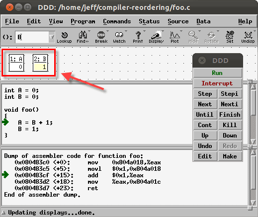

[zz] The Happens-Before Relation | 2013-07-04 | multicore

[原文在此](http://preshing.com/20130702/the-happens-before-relation)

*happens-before* 是一个现代计算机科学里的一个术语,
是c++11,java,Go甚至是llvm中描述软件内存模型的基础.

你会在上述语言的规范中找到*happens-before* 的定义.
虽然每个规范中的说法不一,但是,通常意思都是一样的.
简单的说,通常的定义如下:

*假设A和B表示一个多线程的程序执行的两个操作.
如果A **happens-before** B,那么A操作对内存的影响
将对执行B的线程(且执行B之前)可见.*

当你考虑内存重排序可能使无锁编程变得复杂时,
A*happens-before* B的保证可能是你希望得到的.
有几种方式可以获得这个保证,每种编程语言之前可能会稍许不同,
但是,显而易见的是所有的语言都依赖处理器层次上的相同的机制.

无论你使用哪种编程语言,有一点是相同:
如果操作A和B在相同的线程中执行,同时A操作的声明在B之前,
那么A*happens-before* B.这是我之前的一篇博客中提到的
"内存排序的核心规则"中的基础.

~~~ 
int A, B;

void foo()
{
    // This store to A ...
	A = 5;

    // ... effectively becomes visible before the following loads. Duh!
    B = A * A;
}
~~~
这不是获得*happens-before* 关系的唯一方式. C++11标准中提到,
在不同的线程中使用acquire和release元语,同样可以获得相同的效果.
我会在后续的文章中介绍更多有关*synchronizes-with* 的相关内容.

在每个语言中,无论你使用那种方式获得,*happens-before* 关系都是可传递的:
如果A*happens-before* B,同时B*happens-before* C,那么A*happens-before* C.
你将在下一篇文章看到,当这些关系发生在不同的线程中,传递性将变得非常有用.

我很确信这个关系的名字可能会误导一些人.这里有必要澄清一下:
在上面描述的*happens-before* 关系和A操作在B之前发生不同！详细的说:

1. A*happens-before* B并不意味着A在B之前发生.
2. A在B之前发生并不意味着A*happens-before* B.

这两个陈述看似矛盾,其实并不是.我会在后面的章节试着解释这点.
记住,*happens-before* 是一系列语言规范中定义的操作间的关系.
它和时间的概念独立.这和我们通常说"A在B之前发生"时表达的真实世界中事件的时间顺序不同.
在该文章中,我会使用连字符的形式表示术语*happens-before* 用以区分.

## Happens-Before并不意味着Happening Before

这里有个例子,其中的操作具有*happens-before* 关系,
但是实际上并不是按照那个顺序发生的.
下面的代码执行了(1)对A的赋值,紧接着是(2)对B的赋值.
根据程序顺序的规则,(1)*happens-before* (2)

~~~ 
int A = 0;
int B = 0;

void main()
{
    A = B + 1;              // (1)
	B = 1;                  // (2)
}
~~~
但是,如果我们使用`gcc -O2`编译这个代码,编译器将产生一些指令重排序.
结果是,当我们使用调试器在汇编级别上进行单步调试,
我们将清楚看到第二条机器指令(对B的赋值)完成时,对A的赋值还没有.
换句话说,(1)并没有在(2)之前发生!

那么,这里违反了*happens-before* 关系了吗?让我们来分析下,根据定义,
操作(1)对内存的影响必须在操作(2)执行之前对其可见.
换句话说,对A的赋值必须有机会对B的赋值有影响.

但是在这个例子中,对A的赋值其实并没有对B的赋值有影响.
即便(1)的影响真的可见,(2)的行为还是一样.
所以,这并不能算是违背*happens-before* 规则.
我必须承认,这个解释有点不确定,但是,
我确信它和所有语言规范中描述的*happens-before* 意思一致.

## Happening Before并不意味着Happens-Before

这个例子中,所有的操作按照制定的顺序发生,但是并不构成*happens-before* 关系.
在下面的代码中,假设一个线程调用`pulishMessage`,同时,另一个线程调用`consumeMessage`.
由于我们并行的操作共享变量,为了简单,我们假设所有对int类型的变量的操作都是原子的.
根据程序的顺序,在(1)和(2)之间存在*happens-before* 关系,同时在(3)和(4)之间也存在.

~~~ 
int isReady = 0;
int answer = 0;

void publishMessage()
{
    answer = 42;                      // (1)
    isReady = 1;                      // (2)
}

void consumeMessage()
{
    if (isReady)                      // (3) <-- Let's suppose this line reads 1
        printf("%d\n", answer);       // (4)
}
~~~
除此之外,我们假设在运行时,`isReady`读到1(是由另一个线程在(2)中赋的值).
在这中情形下,我们可知(2)一定在(3)之前发生.
但是这并不意味着在(2)和(3)之间存在*happens-before* 关系!

*happens-before* 关系只在语言标准中定义的地方存在.
同时这里都是普通的store和load操作,
C++11标准中没有相关的规则说明(2)和(3)之间存在*happens-before* 关系,
即便(3)读到了(2)赋的值.

还有,由于(2)和(3)之间,(1)和(4)之间都不存在*happens-before* 关系,
那么(1)和(4)的内存交互也可能被重排序
(要不然来自编译器的指令重排序,要不然来自处理器自身的内存重排序)
那样的话,即使(3)读到1,(4)也会打印出"0"

这篇文章实际上没有什么新的东西,
我们已经知道在执行无锁的代码时,内存交互操作可能会被重排序.
我们已经检验过在C++11,Java,Go以及LLVM中内存重排序时的特殊场景.
即便是[Mintomic](http://mintomic.github.io/)(我几星期前写的库),
也依赖于对*happens-before* 的保证,因为它模仿C++11 原子库的功能行为.

我认为*happens-before* 关系和真实的操作的执行顺序两者之间的不确定性,
是导致底层无锁编程变得如此不好掌握的一个因素.
如果没有其他什么的,这篇文章应该已经阐述了*happens-before* 是一个有用的保证,
当然这在线程之间并不是廉价的.我会在后续的文章扩展说明这第一点.
