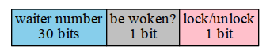

Read Go - Sync | 2013-06-06 | go

今天来说说Go中提供一些同步方法,主要有大家都熟悉的:
- mutex
- rwlock
- condition
- WaitGroup
- Once

## semaphore

上述的概念的实现都基于runtime提供的semaphore机制,
简单的说,就是基本的睡眠和唤醒机制.
所以有必要先理解这个基本的概念.

其实runtime中的semaphore的实现原理和[plan 9中的semaphore][1]类似.

[1]: http://swtch.com/semaphore.pdf

只不过其中的thread的概念换成了goroutine.
该semaphore有2个操作:acquire和release.

### acquire

在acquire处理逻辑中分为快路和慢路,
快路指的是不需要等待就可以直接获得该资源的使用权,
对应的操作就是`semaphore--`.
反之则为慢路,这里需要等待其他goroutine释放资源的使用权.
所有需要等待的goroutines都会被放入一个等待队列.

### release

release的操作首先是释放资源的使用权(`semaphore++`),
接着查看是否有goroutines正在等待该资源,
如果有的话,将其从等待队列中取出,并将其唤醒.

注意这里的等待队列是FIFO的(先入先出).

## mutex

有了runtime提供的基本的睡眠和唤醒机制,
下面我们在其基础上实现mutex的功能.

首先,我们明确下mutex的功能需求:

- 资源的使用者只能有1个.
- 如果有多于1个使用者尝试占有该资源,
只有第一个人会成功的占有,后续的人都会等待其释放该资源.
- 如果尝试释放已经释放的资源,将产生一个异常.

下面来看下mutex的具体实现,首先是数据结构:

~~~
type Mutex struct {
	state int32
	sema  uint32
}
~~~
这里的`sema`字段就是上述的runtime中的semaphore,
提供基本的睡眠和唤醒功能.

`state`用于记录该mutex的实时状态,主要有下面3部分内容:

- 该mutex是否处于lock还是unlock状态.
- 在该mutex上处于等待状态的goroutine的数量
- 是否有操作被成功唤醒.

上述3种信息在`state`中的分布如下:

### lock

1. 如果当前mutex为unlock状态,将其置为lock状态,直接返回.
2. 反之,则`waiter number++`, 同时更新`state`字段,并进入睡眠状态.
3. 如果被唤醒,则清除`woken`标记, 同时更新`state`字段,最后返回.

### unlock

1. 如果当前mutex已经处于unlock状态,则产生panic.
2. 清除`locked`标记,如果没有等待的goroutine,
或者已经有goroutine被唤醒,
或者已经有goroutine获得该mutex则直接返回.
3. 反之则需要唤醒一个等待的goroutine,同时将`waiter number--`,
且将`woken`标记置1,最后更新`state`字段.

## once

once的结构比较简单:

~~~
type Once struct {
	m    Mutex
	done uint32
}
~~~
这里最先活动`mutex`的goroutine,首先执行Do传入的函数,
之后将`done`置1,后续的Do调用检查到`done`为1,则直接返回.
从而保证了被Do传入的函数只会被执行1次.

## rwlock

先来看数据结构:

~~~
// An RWMutex is a reader/writer mutual exclusion lock.
// The lock can be held by an arbitrary number of readers
// or a single writer.
// RWMutexes can be created as part of other
// structures; the zero value for a RWMutex is
// an unlocked mutex.
type RWMutex struct {
	w           Mutex  // held if there are pending writers
	writerSem   uint32 // semaphore for writers to wait for completing readers
	readerSem   uint32 // semaphore for readers to wait for completing writers
	readerCount int32  // number of pending readers
	readerWait  int32  // number of departing readers
}
~~~
这里存在2个semaphore:`writerSem`和`readerSem`,
作用显而易见:
当尝试写时,还存在读操作没有完成,这是写操作会在`writerSem`上睡眠,
当最后一个读操作完成时,会将写操作唤醒.
同理,当尝试读操作时,有另外的写操作还没有完成,这时读操作会在`readerSem`上睡眠,
当写操作完成时,同样会将读操作唤醒.

这里有个corner case需要关注下:
如果在写等待的过程,一直有新的读操作产生,那么按照上述的逻辑,
写操作可能永远处于睡眠状态,得不到执行.
这里有个trick的设计,在写操作进入睡眠等待之前,
会将`readerCount`减去一个很大的数,使其变为一个负数,
当新的读操作产生时,如果检查到`readerCount`是个负数,
同样会在`readersem`睡眠等待,
这样只要在写操作之前的读操作完成,写操作便会执行.

## condition

对condition的操作有3个:

- Wait: 将当前goroutine进入睡眠,等待指定的条件满足.
- Signal: 唤醒处于等待的一个goroutine,告知其条件已满足.
- Broadcast: 唤醒处于等待的所有的goroutines,告知其条件已满足.

在condition数据结构,有几个很有意思的字段:

~~~
type Cond struct {
	L Locker // held while observing or changing the condition
	m Mutex  // held to avoid internal races

	// We must be careful to make sure that when Signal
	// releases a semaphore, the corresponding acquire is
	// executed by a goroutine that was already waiting at
	// the time of the call to Signal, not one that arrived later.
	// To ensure this, we segment waiting goroutines into
	// generations punctuated by calls to Signal.  Each call to
	// Signal begins another generation if there are no goroutines
	// left in older generations for it to wake.  Because of this
	// optimization (only begin another generation if there
	// are no older goroutines left), we only need to keep track
	// of the two most recent generations, which we call old
	// and new.
	oldWaiters int     // number of waiters in old generation...
	oldSema    *uint32 // ... waiting on this semaphore

	newWaiters int     // number of waiters in new generation...
	newSema    *uint32 // ... waiting on this semaphore
}
~~~
首先是2把锁:

- L: 用于观察添加改变和修改条件所需的锁.
- m: 用于内部数据结构修改的锁.

下面是2个semaphores,很有意思的是为什么需要2个呢？

首先我来看下使用一个会有什么问题,考虑下面的场景:

1. goroutine 0 executes, stops in cv.wait()
- goroutine 1 executes, sets state to 1, calls cv.signal()
- goroutine 2 executes, stops in cv.wait()
- goroutine 2 unblocks, due to signal from (2)
- goroutine 2 loops, blocks again on cv.wait()

注意有2点需要强调的:

1. `cv.wait`是在L和m都被unlock情况下尝试获得semaphore.
2. 这里的goroutine 1, 2, 3是并行的.

那么这样一种特殊的情况就有可能发生:

goroutine 0在尝试acquire semaphore之前被调度出去,
goroutine 1被执行,获得内部的锁m,
从而release semaphore,最后返回退出,
这时goroutine 2被执行,和goroutine 0一样,
尝试acquire semaphore,
幸运的是,它没有重蹈goroutine 0的覆辙,
获得了semaphore,发现`semaphore == 1`,
从而直接返回了.
下一次goroutine 2重复尝试获取semaphore,
这样,goroutine 0只有被重新调度执行才有可能被唤醒.

这里就不满足了FIFO的原则,goroutine 0在2之前等待,
但是却在2之后被唤醒.

下面来看使用2个semaphores是如何解决这个问题的:

还是上述的执行流程,只不过每次`cv.wait`都是`acquire newSema`
而`cv.signal`都是`release oldSema`,
不过在release之前都会更新semaphore:

~~~
func (c *Cond) Signal() {
	...
	c.m.Lock()
	if c.oldWaiters == 0 && c.newWaiters > 0 {
		// Retire old generation; rename new to old.
		c.oldWaiters = c.newWaiters
		c.oldSema = c.newSema
		c.newWaiters = 0
		c.newSema = nil
	}
	...
	c.m.Unlock()
}
~~~
这样在signal之后等待的`cv.wait`都会在一个新的semaphore等待,
而不会影响到之前的semaphore,这样就巧妙的解决了上述的问题(issue 1648).

## WaitGroup

WaitGroup的数据结构如下:

~~~
type WaitGroup struct {
	m       Mutex
	counter int32
	waiters int32
	sema    *uint32
}
~~~
注意:这里`sema`字段是一个指针,道理和condition中的设计一样,
防止多goroutines并行的情形下,对同一个semaphore的操作会相互影响.
引用代码中一段注释:

~~~
// WaitGroup creates a new semaphore each time the old semaphore
// is released. This is to avoid the following race:
//
// G1: Add(1)
// G1: go G2()
// G1: Wait() // Context switch after Unlock() and before Semacquire().
// G2: Done() // Release semaphore: sema == 1, waiters == 0. G1 doesn't run yet.
// G3: Wait() // Finds counter == 0, waiters == 0, doesn't block.
// G3: Add(1) // Makes counter == 1, waiters == 0.
// G3: go G4()
// G3: Wait() // G1 still hasn't run, G3 finds sema == 1, unblocked! Bug.
~~~

这里还有2个字段:

- counter: WaitGroup的计数,也是我们Add操作的对象.
- waiters: wait该WaitGroup的goroutine的数量.

其中Add(delt)中的主要操作如下:

1. atomic_add(counter, delt).(#1)
2. 如果`counter == 0`,同时`waiters > 0`则唤醒等待的goroutine,反之则返回.(#2)

而wait的操作如下:

1. atomic_add(waiters, 1).(#3)
2. 如果`counter > 0`则睡眠等待,反之则返回.(#4)

注意这里wait中2个步骤的先后顺序,这里不能先读counter的计数,
然后`waiter++`,原因是上述的Add和wait可能并行发生.
根据MM中的规则,这里只能保证Add操作中的步骤1在2之前发生,
wait操作中的步骤1在步骤2之前发生.

这里,我们调换wait操作中2个步骤的顺序,也就是先读counter计数,
如果其大于0,则`waiter++`然后进入等待,通过下表,我们来分析所有可能存在的情形.
这里1,2,3,4对应上述步骤后面的序号,执行顺序只需要满足`1->2, 4->3`即可,
同时这里假定goroutine A执行Add(-1)操作,
且为该WaitGroup最后一个done的goroutine,
而与之并行的goroutine B执行wait操作.

执行顺序 | goroutine A | goroutine B
:---: | :---: | :---:
`1->2->4->3` | 直接返回 | 直接返回
`1->4->2->3` | 直接返回 | 直接返回
`1->4->3->2` | 直接返回 | 直接返回
`4->1->3->2` | 唤醒B | 睡眠等待
`4->3->1->2` | 唤醒B | 睡眠等待
`4->1->2->3` | 直接返回 | 睡眠等待

可以看出上表中最后一种情形A并没有正确唤醒B,造成了死锁!

而按照正确的顺序，即满足`1->2, 3->4`的情形又是怎样的:

执行顺序 | goroutine A | goroutine B
:---: | :---: | :---:
`1->2->3->4` | 直接返回 | 直接返回
`1->3->2->4` | 唤醒B | 睡眠等待
`1->3->4->2` | 直接返回 | 直接返回
`3->1->4->2` | 直接返回 | 直接返回
`3->4->1->2` | 唤醒B | 睡眠等待
`3->1->2->4` | 唤醒B | 睡眠等待

这里的所有情形都是正确的.

FIN.
