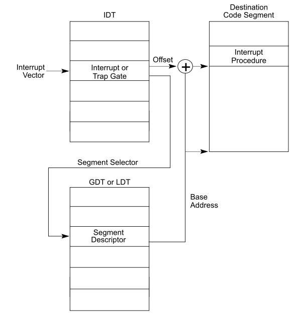
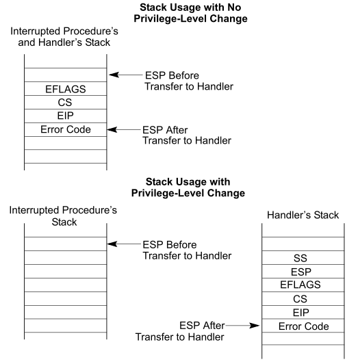
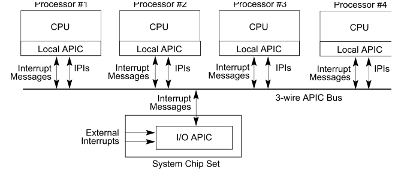
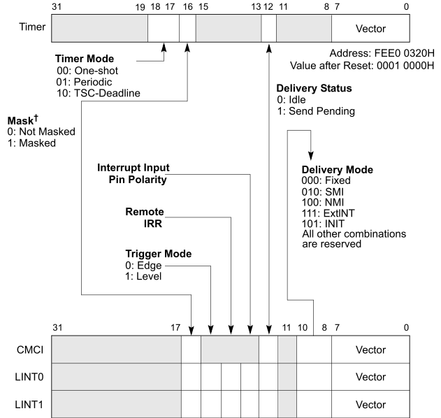

x86 interrupt initialization | 2013-09-09
# x86 interrupt initialization

这几天在bochs上动手实践了一下中断初始化,
和之前使用PIC不同,这次使用的APIC,
具体的代码在[github](https://github.com/tw4452852/tos)上.

针对终端的初始化,主要有两方面的工作:

1. CPU方面: 中断向量(IDT)的初始化.
2. 中断控制器方面: local APIC和IO APIC的初始化.

## IDT

---

对于intel的cpu,有一个称为IDT的表用于处理中断,
其中,对于x86的cpu的共有256表项(0-255).

对于大多是的平台,主要有3大类的中断类型:

- 异常: 由cpu内部触发,用于通知内核有需要关注的事件发生.
对于x86 cpu,这些事件有例如重复异常、缺页异常、通用保护异常等等.
- 硬件中断: 有外部芯片触发通过#INTR硬件管脚通知cpu.
如今通常有2种硬件中断:

	1. 基于硬件管脚的中断: 通常将产生中断的连线和中断请求控制器相连.
	该控制器将收集到的中断顺序发给cpu,从而避免相互竞争.
	在很多场景下,一个中断控制器会一次发送多个不同优先级的中断.
	2. 基于消息的中断: 通过向特定的内存地址写入一个值,从而告知
	中断的相关信息.
- 软件中断: 由运行在cpu上的软件触发来通知内核.
这些中断通常用于系统调用.

IDT中每个条目的结构如下:

~~~ {prettyprint lang-c}
struct IDTDescr{
	uint16_t offset_1; // offset bits 0..15
	uint16_t selector; // a code segment selector in GDT or LDT
	uint8_t zero;      // unused, set to 0
	uint8_t type_attr; // type and attributes, see below
	uint16_t offset_2; // offset bits 16..31
};
~~~
`type_attr`:

~~~ {prettyprint}
7                           0
+---+---+---+---+---+---+---+---+
| P |  DPL  | S |    GateType   |
+---+---+---+---+---+---+---+---+
~~~

其中每个字段的含义如下:

Name | Bit | Full Name | Description
:---: | :---: | :---: | :---:
Offset | 48..63 | Offset 16..31 | 偏移的高位部分
P | 47 | Present | 对于不用的中断,或者内存页不在设置为0
DPL | 45,46 | Descriptor previlege level | 调用该描述符的最低等级
S | 44 | storage Segment | 对于中断描述符必须为0
Type | 40..43 | Gate type | 0xe:80386 32位中断门
0 | 32..39 | unused 0..7 | 0
Selector | 16..31 | Selector 0..15 | 中断回调函数所在的段选择子
Offset | 0..15 | Offset 0..15 | 偏移的低位部分

这样通过段选择子和偏移便可以找到对应的中断回调函数:

下面来看下中断回调函数,在开始之前,有必要知道当中断触发时,
cpu为我们已经做了哪些事,由于当中断结束时,需要返回到原来的执行流,
所以cpu在内核栈上放上了返回的指令地址(包括段寄存器和偏移),
对于一些异常,cpu还会放入错误码,用于提供关于错误的更多的信息.
注意,这里栈特指内核栈,如果由用户态程序切换过来,还回填上用户态的栈的信息
(栈寄存器和偏移)

现在的中断回调函数比较简单,只是将stack上的信息打印在屏幕上,
这里为了简化处理不同的情况,对于那些没有error code的中断,
也会在stack伪造一个值(0).

~~~ {prettyprint}
exception_handler_start:
i = 0
# intel reserve exception or fault
.rept IDT_MAX_EXCEPTION
	.if (EXCEPTION_ERRCODE_MASK >> i) & 1
		nop
		nop
	.else
		pushl $0
	.endif
	pushl $i
	jmp exception_handler
i = i + 1
.endr
~~~

由于这里中断并没有屏蔽其他中断,也就是说在中断处理过程中,
别的中断也有可能发生,同时由于优先级高于当前中断,而将当前中断的处理流程打断,
转而处理更高优先级的中断,所以这里有必要防止代码重入,
这里限定同时只能有2个中断可以被处理,
这是由于在每个cpu存在2个中断队列(ISR,IRR,具体参见intel手册卷3 10.8.4)

~~~ {prettyprint}
exception_handler:
	cld
	cmpl $2, %ss:recursion_flag
	je hlt_loop
	incl %ss:recursion_flag

	# 0(sp): irq number
	# 4(sp): error code
	# 8(sp): eip
	# 12(sp): cs
	# 16(sp): eflag
	call default_handler
	addl $8, %esp # skip irq number and error code

	decl %ss:recursion_flag
	iret

hlt_loop:
	hlt
	jmp hlt_loop
~~~
细心的读者可能发现,这里没有发送`EOI`来通知中断已经处理完成,
其实这个工作是在`default_handler`完成的,
由于设计APIC,故放在后面讲解.

**NOTE:**这里在使用`iret`指令返回之前,需要调整好stack.

至此关于cpu部分的初始化工作就完成了.

## APIC

---

首先来看下多核架构下APIC的整体结构:

可以看出每个cpu都有一个local apic与之对应,
同时,至少会存在一个全局的io apic用于接收外部中断,
充当传统的PIC(8259A)的角色.

很显然,如果要使用apic,必要要初始化local apic和io apic两部分.

### Local APIC

---

Local APIC其实是cpu芯片上的一个电路,主要有以下几个功能:

1. 产生核间中断(IPI)
- 接收中断
- timer

核间中断对于多核系统是非常必要的,它提供了核间通信的可能性.
同时它提供timer的功能,同时该timer是每个processor独有的,
和传统的全局的RTC不同,这样便可以利用该timer实现每个processor
自己的调度器,消除了processors之间的相互影响.

当然local APIC最主要的功能是用于接收中断,
无论是外部设备产生的还是其他processor产生的,
对于外部中断,有两个硬件管脚可以配置,一般一个用于不可屏蔽中断(NMI),
一个用于接收外部io apic发过来的中断

这里主要通过一个叫local vector table来进行配置:

初始情况下,所有的interrupt都是被禁用的,
这里为了简单起见,只对local interrupt 0/1进行配置

~~~ {prettyprint lang-c}
void
lapic_init()
{
	...
	// local interrupt 0 is a external interrupts
	lapic_write_reg(_LAPIC_LINT0_OFFSET, 0x8700);
	// local interrupt 1 is a nmi
	lapic_write_reg(_LAPIC_LINT1_OFFSET, 0x400);
	...
}
~~~
可以看出这里用lvt0接收io apic转发过来的中断,
lvt1接收不可屏蔽中断.
这样最简单的local apic的初始化便完成了.

之前说过在中断回调函数返回之前需要发送EOI信号,
告知中断控制器该中断已被cpu处理完成,
这里主要是通过向local apic的EOI寄存器进行写操作完成.

~~~ {prettyprint lang-c}
void
apic_eoi(u32 irq)
{
	lapic_write_reg(_LAPIC_EOI_OFFSET, 0);
}
~~~

### IO APIC

---

io apic不同于local apic,它是单独的一个芯片,
和每个local apic相连,这样它便可以将中断转发给各个processor.

io apic主要存在于多核系统中,与传统的PIC相比,
它可以将中断转发到的特定的processor(s)上,

每个io apic有可以处理24个不同的外部中断,其中0-15对应标准的0-15中断,
16-19用于PCI A/B/C/D中断,20-22暂时没用,23用于SMI中断.

每个io apic中断向量的配置对应64bits:

字段名称 | 位段 | 描述
:---: | :---: | :---:
向量号 | 0-7 | 对应于每个cpu上产生的中断向量号
传输模式 | 8-9 | fixed(0),lowest-priority(1),SMI(2),NMI(4),INIT(5),ExtINT(7)
目标模式 | 11 | 物理目标(0),逻辑目标(1)
转发状态 | 12 | 0(已转发已处理), 1(等待被转发)
硬件管脚有效值 | 13 | 高电平有效(0), 低电平有效(1)
IRR状态 | 14 |
触发模式 | 15 | 边沿触发(0),电平触发(1)
屏蔽位 | 16 | 屏蔽该中断(1),使能该中断(0)
保留位 | 17-55 |
目标 | 56-63 | 处理器的apic id

在初始化这24个中断向量之后,ioapic原则上就可以正常工作了,
不过有2点需要注意下:

- 如果主板上同时存在pic和io apic需要屏蔽所有的pic中断.

~~~ {prettyprint lang-c}
static inline void
disable_8259()
{
	outb(0x21, 0xff);
	outb(0xa1, 0xff);
}
~~~

- 在一些老板子上,需要显式的告诉pic将中断转到io apic上.

~~~ {prettyprint lang-c}
static inline void
switch_to_apic()
{
	// for recently motherborad, there is no need to do these
	outb(0x22, 0x70);
	outb(0x23, 0x01);
}
~~~

至此,io apic所需的最简初始化就完成了.
从此刻便可以通过`sti`指令开启中断的接收功能,
正常处理中断了.
在daemon代码中,简单的注册了一个键盘中断(irq1),
每当按下一个键,便会触发一个中断,从而对应的中断回调函数被执行
(具体参见keyboard.c).

FIN.
